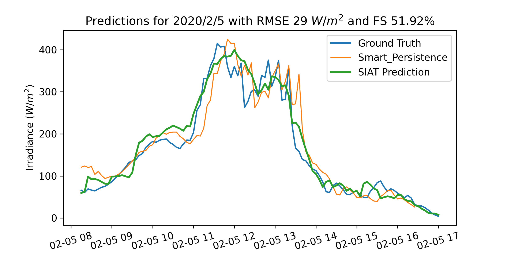

# Solar Irradiance Anticipative Transformer - SIAT
Official repository for "Solar Irradiance Anticipative Transformer" paper to be published in CVPR workshop Earth Vision 2023

We are honored that the Earth Vision organizing committee has selected our work as the recipient of the Best Paper.

The SIAT model consists of a Vision transformer backbone that acts as a feature extractor for individual all-sky images. This part of the model is referred to as the backbone. For a sequence of images the extracted feature vectors are fed into the head model, which uses the huggingface GPT2 implementation. This allows the model to forecast irradiance multiple timesteps into the future.

[Link to paper](https://arxiv.org/abs/2305.18487)

To run both the backbone and the full model with dummy input tensors please run models_with_dummy_input.py from the main directory.

The results for the competing ECLIPSE model are based on an unoffical implementation: [Link](https://github.com/tcapelle/eclipse_pytorch/blob/13b1c41b076a535eb01abf37f777f9fa8309ee48/eclipse_pytorch/model.py)

Full training code coming soon.
